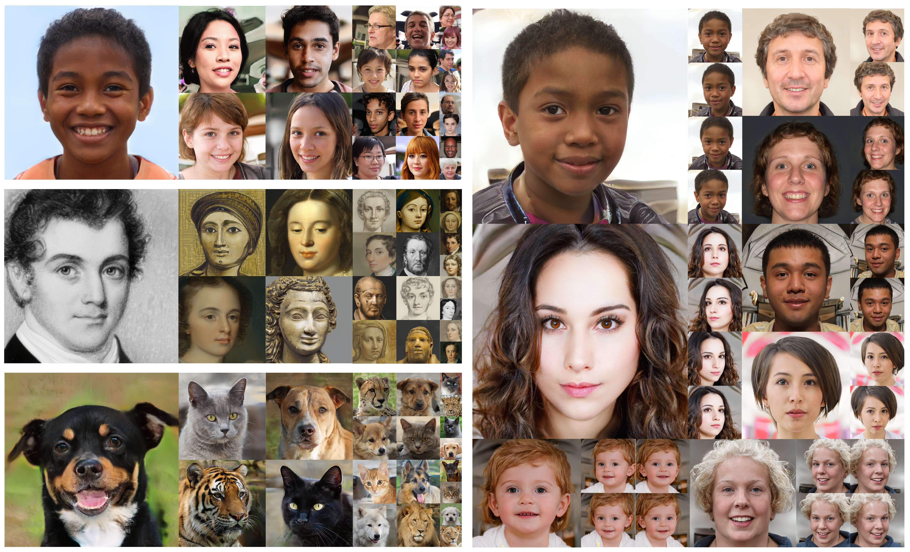

# StyleNeRF: A Style-based 3D-Aware Generator for High-resolution Image Synthesis</sub>



**StyleNeRF: A Style-based 3D-Aware Generator for High-resolution Image Synthesis**<br>
Jiatao Gu, Lingjie Liu, Peng Wang, Christian Theobalt<br>
### [Project Page](http://jiataogu.me/style_nerf) | [Video](http://jiataogu.me/style_nerf) | [Demo](https://huggingface.co/spaces/facebook/StyleNeRF) | [Paper](https://arxiv.org/abs/2110.08985) | [Data](#dataset)<br>

Abstract: *We propose StyleNeRF, a 3D-aware generative model for photo-realistic high-resolution image synthesis with high multi-view consistency, which can be trained on unstructured 2D images. Existing approaches either cannot synthesize high-resolution images with fine details or yield noticeable 3D-inconsistent artifacts. In addition, many of them lack control over style attributes and explicit 3D camera poses. StyleNeRF integrates the neural radiance field (NeRF) into a style-based generator to tackle the aforementioned challenges, i.e., improving rendering efficiency and 3D consistency for high-resolution image generation. We perform volume rendering only to produce a low-resolution feature map and progressively apply upsampling in 2D to address the first issue. To mitigate the inconsistencies caused by 2D upsampling, we propose multiple designs, including a better upsampler and a new regularization loss. With these designs, StyleNeRF can synthesize high-resolution images at interactive rates while preserving 3D consistency at high quality. StyleNeRF also enables control of camera poses and different levels of styles, which can generalize to unseen views. It also supports challenging tasks, including zoom-in and-out, style mixing, inversion, and semantic editing.*

## Requirements
The codebase is tested on 
* Python 3.7
* PyTorch 1.7.1
* 8 Nvidia GPU (Tesla V100 32GB) with CUDA version 11.0

For additional python libraries, please install by:

```
pip install -r requirements.txt
```

Please refer to https://github.com/NVlabs/stylegan2-ada-pytorch for additional software/hardware requirements.

## Dataset
We follow the same dataset format as [StyleGAN2-ADA](https://github.com/NVlabs/stylegan2-ada-pytorch#preparing-datasets) supported, which can be either an image folder, or a zipped file.

## Pretrained Checkpoints
You can download the pre-trained checkpoints (used in our paper) and some recent variants trained with current codebase as follows:
| Dataset   | Resolution | #Params(M) | Config |                           Download                           |
| :-------- | :--------: | :--------: | :----: | :----------------------------------------------------------: |
| FFHQ      |    256     | 128        | Default |  [Hugging Face 🤗](https://huggingface.co/facebook/stylenerf-ffhq-config-basic/blob/main/ffhq_256.pkl) |
| FFHQ      |    512     | 148        | Default |  [Hugging Face 🤗](https://huggingface.co/facebook/stylenerf-ffhq-config-basic/blob/main/ffhq_512.pkl) |
| FFHQ      |    1024    | 184        | Default |  [Hugging Face 🤗](https://huggingface.co/facebook/stylenerf-ffhq-config-basic/blob/main/ffhq_1024.pkl) |

（I am slowly adding more checkpoints. Thanks for your very kind patience!)


## Train a new StyleNeRF model
```bash
python run_train.py outdir=${OUTDIR} data=${DATASET} spec=paper512 model=stylenerf_ffhq
```
It will automatically detect all usable GPUs.

Please check configuration files at ```conf/model``` and ```conf/spec```. You can always add your own model config. More details on how to use hydra configuration please follow https://hydra.cc/docs/intro/.

## Render the pretrained model
```bash
python generate.py --outdir=${OUTDIR} --trunc=0.7 --seeds=${SEEDS} --network=${CHECKPOINT_PATH} --render-program="rotation_camera"
```
It supports different rotation trajectories for rendering new videos.

## Run a demo page
```bash
python web_demo.py 21111
```
It will in default run a Gradio-powered demo on https://localhost:21111

[NEW]
The demo is also integrated into [Huggingface Spaces 🤗](https://huggingface.co/spaces) using [Gradio](https://github.com/gradio-app/gradio). Try out the Web Demo: [](https://huggingface.co/spaces/facebook/StyleNeRF)


## Run a GUI visualizer
```bash
python visualizer.py
```
An interative application will show up for users to play with.

## Citation

```
@inproceedings{
    gu2022stylenerf,
    title={StyleNeRF: A Style-based 3D Aware Generator for High-resolution Image Synthesis},
    author={Jiatao Gu and Lingjie Liu and Peng Wang and Christian Theobalt},
    booktitle={International Conference on Learning Representations},
    year={2022},
    url={https://openreview.net/forum?id=iUuzzTMUw9K}
}
```


## License

Copyright &copy; Facebook, Inc. All Rights Reserved.

The majority of StyleNeRF is licensed under [CC-BY-NC](https://creativecommons.org/licenses/by-nc/4.0/), however, portions of this project are available under a separate license terms: all codes used or modified from [stylegan2-ada-pytorch](https://github.com/NVlabs/stylegan2-ada-pytorch) is under the [Nvidia Source Code License](https://nvlabs.github.io/stylegan2-ada-pytorch/license.html).


